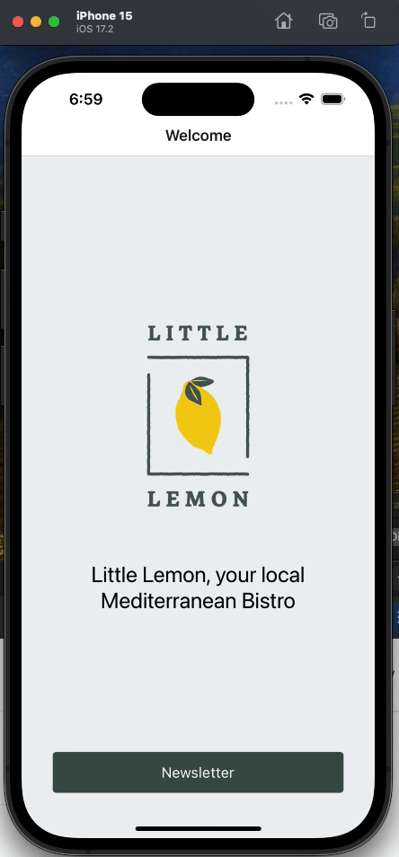

## Little Lemon

Little Lemon newsletter sign-up application.

### Review criteria

- Is the Native Stack Navigation setup appropriately in the navigators/Root Navigator.js file?

- Is there a Welcome screen component that contains View, Text, Image and Pressable components?

- Is there a “Newsletter” button on the Welcome screen that moves to the Subscribe screen when clicked?

- Is there a TextInput component on the Subscribe screen which displays a text input box that prompts the user to enter an email address?

- Is there a button on the Subscribe screen that is only enabled after text has been entered in the text input box above?

- Does clicking the Subscribe button trigger an alert containing a confirmation message?

- Is the Little Lemon logo image rendered on both the Welcome Screen and the Subscribe Screen using the Image component?

- In the code, are StyleSheets used to store styles outside of the component’s render?

### Result

